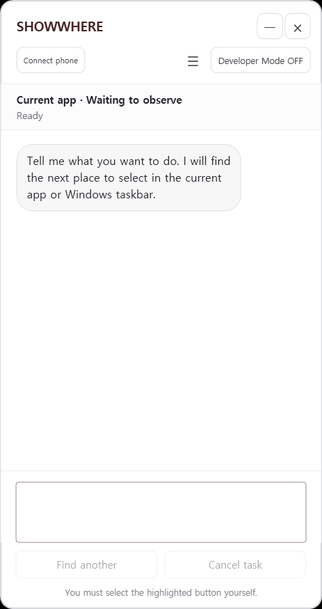
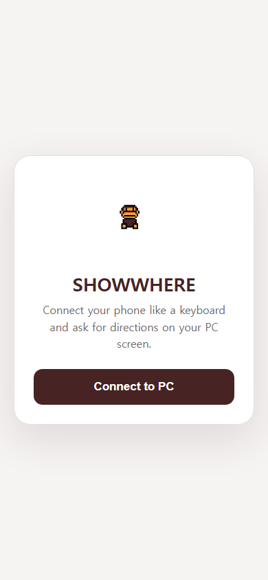
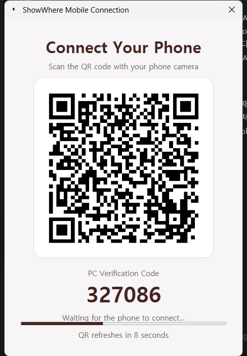

# ShowWhere

### Tell it what you want. ShowWhere shows you where.

**An AI visual guide that looks at the screen you are using and highlights what to select next.**

**English** · [한국어](README.ko.md)

---

## Technology should not become unusable just because its controls are hard to find

Modern software can do more than ever, but every new feature brings another menu, icon, setting, and hidden option. The function may already exist. The user may even know exactly what they want to accomplish. What they do not know is **where to click**.

Traditional help gives people a paragraph of instructions and leaves them to search the interface again. ShowWhere closes that gap.

## What is ShowWhere?

> **Tell ShowWhere what you want to do. It observes the current computer or web screen and highlights the next place to select—directly on that screen.**

ShowWhere is not just an AI that explains software. It is a visual guide that stays beside the user while the task is being completed.

Instead of reading instructions, translating them into menu names, and getting lost again, the user follows the highlighted location and completes the work with their own hands. After each interaction, ShowWhere observes the new screen and guides the next step until the goal is complete.

  
   
  The ShowWhere Windows guide, ready for a new request.

## How it works

| Step | Experience |
|---|---|
| **1. Ask** | Say or type what you want to accomplish in natural language. |
| **2. Observe** | ShowWhere examines the current Windows application or web screen. |
| **3. Highlight** | The next relevant control is marked directly on the display. |
| **4. Follow** | Select the highlighted location yourself and remain in control. |
| **5. Complete** | ShowWhere follows the screen changes, continues step by step, and stops when the goal is reached. |

## Where ShowWhere can help

ShowWhere is built around a simple idea: if a task happens on a screen, guidance should happen on that same screen.

### Everyday computer use

- Find printer and Windows settings
- Locate files and familiar system tools
- Discover a feature inside an application
- Navigate an unfamiliar menu without memorizing its structure

### Web

- Find sign-in and account controls
- Navigate orders, carts, and account settings
- Move through complex site menus
- Reach the right search field or action for the current website—not a different application

### Work

- Learn an unfamiliar internal program
- Find settings and administration tools
- Follow tasks in POS and back-office interfaces
- Support employee onboarding, training, and technical assistance

### Restaurants, stores, and kiosks

- Navigate ordering and menu workflows
- Find modifiers and item-management controls
- Reach image, product, and kiosk-management options
- Help staff use functions they do not perform every day

ShowWhere currently ships as a Windows application and can guide Windows UI, browser interfaces, and screen-based kiosk flows that the application can observe.

## Mobile Sync: a phone becomes the input remote

A kiosk may have a touchscreen but no physical keyboard. ShowWhere's Mobile Sync makes that environment usable without attaching extra hardware.

Open **Connect phone** in the PC app, scan the QR code, and confirm the six-digit pairing code. The paired phone can then:

- Send text commands directly to ShowWhere on the PC
- Use speech-to-text for voice input
- See ShowWhere's responses on the phone
- Continue the same guided task through the deployed HTTPS service

The PC guidance remains on the kiosk while the phone acts as a private, convenient input remote. This is especially useful at counters, restaurants, stores, shared terminals, and other keyboardless environments.

<table>
  <tr>
    <td width="50%" align="center">
      
       
      Mobile Web input remote
    </td>
    <td width="50%" align="center">
      
       
      QR and six-digit PC verification
    </td>
  </tr>
</table>

These are real screens from the ShowWhere desktop application and deployed Mobile Web, not design mockups.

**[Open Mobile Web](https://api-production-6901.up.railway.app/mobile/)**

## A guide that learns from verified experience

Repeated problems should not require repeated waiting.

ShowWhere is designed to remember solutions that have been explicitly verified, then reuse them quickly when the same intent appears again. It can also apply that experience to similarly worded requests when their meaning and screen context match.

Human feedback remains important: correct guidance can be confirmed, incorrect guidance can be corrected, and a completed task can be marked as finished. This turns real use into better future guidance while keeping the final decision grounded in the current screen.

## Vision

Technology should not belong only to people who already know where every setting is hidden.

ShowWhere exists so that age, experience, unfamiliar terminology, or constantly changing interfaces do not prevent someone from using a feature that is already available to them. Its goal is to become an always-present digital guide across computers, websites, workplace software, POS systems, back offices, and kiosks—helping anyone move from **“I know what I want”** to **“I did it.”**

### Ready to see where?

