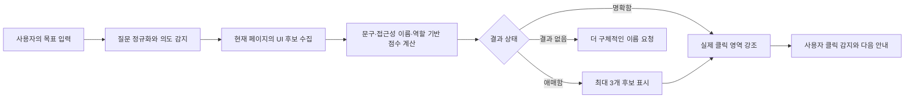

<div align="center">

# ShowWhere

### Don't explain your screen. Just tell us your goal.

화면을 설명하지 않아도, 하고 싶은 일만 말하면<br>
다음에 눌러야 할 위치를 직접 보여주는 인터페이스 내비게이션 도우미


</div>

## Native Windows client

ShowWhere의 기본 클라이언트는 C#/.NET 8 WPF 기반 Windows 데스크톱 앱입니다. 항상 위에 떠 있는 `?` 도우미가 Microsoft UI Automation으로 현재 앱의 의미 있는 컨트롤을 관찰하고, 검증된 `targetId`에 해당하는 실제 위치만 click-through overlay로 안내합니다. 사용자의 버튼을 자동으로 누르지 않습니다.

Chrome 확장 프로그램은 웹 DOM을 더 정확하게 관찰하는 선택적 browser adapter로 계속 제공됩니다. 두 클라이언트 모두 별도 `POST /api/guide` 백엔드를 사용하며 Featherless API 키는 서버 환경에만 존재합니다.

실행과 빌드는 [로컬 개발 문서](docs/development.md), Windows 검증 절차는 [수동 smoke test](docs/windows-smoke-test.md)를 참고하세요.

---

## ShowWhere란?

ShowWhere는 사용자가 **하고 싶은 일**을 입력하면 현재 Windows 애플리케이션 또는 웹페이지를 관찰해 다음에 사용할 컨트롤을 화면 위에 표시하는 인터페이스 내비게이션 도우미입니다.

사용자는 화면 구조나 버튼 위치를 설명할 필요가 없습니다.

> “로그인하고 싶어요.”<br>
> “설정 메뉴 찾아줘.”<br>
> “이 대화의 옵션을 열고 싶어요.”

ShowWhere는 사용자의 목적과 화면에 실제로 존재하는 UI 문구를 연결하고, 다음에 눌러야 할 곳을 화면 위에서 안내합니다.

현재 구현은 독립 실행 가능한 Windows WPF 클라이언트, 선택적 Manifest V3 브라우저 adapter, deterministic mock과 Featherless provider를 지원하는 보안 백엔드로 구성됩니다. 모든 provider 결정은 런타임 계약과 현재 관찰의 candidate ID를 통과해야 합니다.

## 왜 만들었나요?

이 프로젝트는 실제 기술 지원 업무에서 시작되었습니다.

> “설정을 눌러주세요.”<br>
> “설정이 어디 있나요?”<br>
> “오른쪽 위 톱니바퀴입니다.”<br>
> “안 보여요.”

사용자는 프로그램을 몰라서가 아니라, **어디를 눌러야 하는지 몰라서** 멈추는 경우가 많습니다. 상담원 역시 문제를 해결하기보다 버튼 위치를 말로 설명하는 데 많은 시간을 씁니다.

ShowWhere는 한 가지 질문에서 출발했습니다.

> **“말로 설명하지 말고, 그냥 화면에서 보여주면 되지 않을까?”**

## 해결하고 싶은 문제

은행, 정부 사이트, 회사 ERP, POS, 쇼핑몰까지 모든 서비스는 서로 다른 버튼과 메뉴 구조를 사용합니다. 하지만 사용자가 원하는 것은 버튼 자체가 아닙니다.

> **사용자는 자신이 하고 싶은 일을 끝내고 싶습니다.**

ShowWhere는 단순한 버튼 검색기가 아니라, 사용자의 목적을 화면 위에서 다음 행동으로 연결하는 도구를 지향합니다.

## 누구를 위한 프로젝트인가요?

- 처음 사용하는 프로그램이 어려운 사용자
- 컴퓨터와 웹 환경이 익숙하지 않은 사용자와 고령층
- ERP, POS 등 새로운 업무 도구를 배우는 직원
- 화면 위치를 반복해서 설명해야 하는 고객 지원 담당자
- 복잡한 웹사이트를 더 쉽게 이용하고 싶은 모든 사람

## 현재 동작 방식



1. 질문에서 요청형 표현과 일부 조사·어미를 정리합니다.
2. 로그인, 회원가입, 설정, 저장, 메뉴 등 기본 의도를 감지합니다.
3. 현재 페이지의 버튼, 링크, 입력창, 메뉴와 접근성 역할 요소를 수집합니다.
4. `innerText`, `aria-label`, `title`, `placeholder`, 역할과 가시성을 조합해 점수를 계산합니다.
5. 결과가 명확하면 실제 클릭 영역을 강조하고, 애매하면 후보를 먼저 보여줍니다.

이 방식은 AI 기반 의미 이해가 아닙니다. 화면에 있는 정보와 사전에 정의된 규칙을 안전하게 비교하는 프로토타입입니다.

## 주요 기능

### 목표 기반 UI 검색

- 한글·영문 문구와 기본 동의어 지원
- 정확 일치, 부분 일치, compact 문자열, 토큰 유사도 계산
- 로그인, 회원가입, 비밀번호 재설정, 설정, 검색, 저장, 인쇄, PDF, 메뉴, 프로필, 주문 내역 등 기본 의도 지원
- 사전에 없는 문구도 현재 화면의 실제 텍스트와 일치하면 검색 가능

### 명확한 안내 흐름

- 명확한 결과는 바로 스크롤하고 강조
- 비슷한 결과는 최대 3개 후보로 구분
- 동일 질문과 동일 후보에 대한 반복 메시지 방지
- 후보 선택 후 말풍선을 닫지 않고 안내 상태 유지
- `다시 찾기`, `강조 지우기`, 클릭 성공 메시지 제공

### 정확한 클릭 영역 강조

- 텍스트나 SVG 대신 실제 `button`, 링크 또는 클릭 가능한 부모 탐색
- 부모 탐색 깊이와 지나치게 큰 영역 제한
- 대화 행 오른쪽의 점 세 개 옵션 버튼 우선 탐색
- 화면 경계, 최소 크기, 대상의 border-radius를 반영한 fixed overlay
- 스크롤, 창 크기, 대상 크기 변화에 맞춰 위치 추적

### 검증된 mock 안내 파이프라인

- Zod 기반 `UiCandidate`, `TaskSession`, `GuideRequest`, `GuideDecision` 검증
- DOM 참조는 브라우저 내부 registry에만 보관
- mock `/api/guide`가 반환한 candidate ID만 실제 요소로 해석
- 존재하지 않는 target ID와 낮은 confidence를 안전한 재질문으로 전환
- 실제 AI API, API key, 자동 클릭 없이 전체 결정 경로 검증

### 접근성과 안전성

- 키보드 Enter 전송, Shift+Enter 줄바꿈, Escape 닫기
- ARIA dialog, label, live region과 focus-visible 지원
- `prefers-reduced-motion` 지원
- Shadow DOM을 이용한 웹사이트 스타일 격리
- ShowWhere가 버튼을 자동 클릭하지 않고 사용자가 직접 확인 후 클릭

## 설치하기

### 1. 프로젝트 준비

[Node.js LTS](https://nodejs.org/)를 설치한 뒤 저장소를 내려받습니다.

```bash
git clone https://github.com/rudwndgus/ShowWhere.git
cd ShowWhere
npm install
npm run build
```

### 2. Chrome에 확장 프로그램 로드

1. 주소창에서 `chrome://extensions`를 엽니다.
2. 오른쪽 위의 **개발자 모드**를 켭니다.
3. **압축해제된 확장 프로그램을 로드**를 누릅니다.
4. 빌드로 생성된 `ShowWhere/dist` 폴더를 선택합니다.
5. 일반 웹사이트에서 ShowWhere 아이콘을 누릅니다.
6. 화면에 나타난 빨간 물음표를 눌러 원하는 일을 입력합니다.

> `chrome://` 페이지, Chrome Web Store, 새 탭처럼 Chrome이 보호하는 페이지에는 확장 프로그램을 주입할 수 없습니다.

## 개발과 검증

```bash
# TypeScript 검사
npm run typecheck

# 단위 테스트
npm test

# 프로덕션 빌드
npm run build

# 변경 감시 빌드
npm run dev
```

코드 변경 후에는 `npm run build`를 실행하고, `chrome://extensions`의 ShowWhere 카드와 테스트 중인 웹페이지를 차례로 새로고침합니다.

### 테스트 페이지

프로젝트에는 로그인 후보, 접근성 이름, 화면 밖 요소, 대화 옵션 버튼 등을 확인할 수 있는 정적 fixture가 포함되어 있습니다.

```bash
npx vite test-site
```

터미널에 표시된 로컬 주소를 연 다음 ShowWhere를 활성화하고 아래 질문을 시험할 수 있습니다.

- `로그인하고 싶어요`
- `비밀번호를 잊었어요`
- `설정 메뉴 찾아줘`
- `PDF로 저장하고 싶어요`
- `대화 옵션 열어줘`

## 프로젝트 구조

```text
ShowWhere/
├─ public/
│  ├─ icons/                    # 확장 프로그램 아이콘
│  └─ manifest.json             # Chrome Extension Manifest V3
├─ scripts/
│  └─ generate-icons.mjs        # PNG 아이콘 생성 스크립트
├─ src/
│  ├─ background/
│  │  └─ index.ts               # 툴바 클릭과 탭 주입 처리
│  ├─ content/
│  │  ├─ components/            # 도우미, 말풍선, 후보, 메시지, overlay
│  │  ├─ data/                  # 의도와 동의어 사전
│  │  ├─ hooks/                 # 위치 저장과 페이지 변화 감지
│  │  ├─ types/                 # 검색과 후보 타입
│  │  ├─ utils/                 # 정규화, 점수 계산, 대상 해석
│  │  ├─ App.tsx                # 전체 대화 및 안내 상태
│  │  ├─ index.tsx              # Shadow DOM과 React mount
│  │  └─ styles.css             # 격리된 UI 스타일
│  └─ shared/messages.ts        # background/content 메시지
├─ test-site/                   # 수동 검증용 정적 페이지
├─ package.json
├─ tsconfig.json
└─ vite.config.ts
```

## 개인정보 및 보안 원칙

- 외부 API, 서버, 데이터베이스, 분석 도구를 사용하지 않습니다.
- 비밀번호 입력값이나 웹페이지 폼의 실제 사용자 값을 읽지 않습니다.
- 페이지 요소를 자동으로 클릭하거나 폼을 제출하지 않습니다.
- 원본 페이지 요소의 inline style을 변경하지 않습니다.
- `eval`, `dangerouslySetInnerHTML`을 사용하지 않습니다.
- 일반 사이트 지원을 위해 `<all_urls>` 권한을 사용하지만, UI는 사용자가 툴바 아이콘을 누른 탭에서만 활성화됩니다.

## 현재 한계

- 화면에 없는 의미나 복잡한 문맥을 추론하지 못합니다.
- 이미지와 canvas 내부의 글자는 찾을 수 없습니다.
- 접근성 이름이 없는 아이콘은 의미를 파악하기 어렵습니다.
- 닫힌 Shadow DOM과 다른 확장 프로그램 내부는 검색하지 않습니다.
- 여러 단계 작업을 스스로 계획하지 않습니다.
- 검색 결과는 규칙 기반 휴리스틱이며 사이트 구조에 따라 정확도가 달라질 수 있습니다.

## 앞으로의 방향

ShowWhere의 최종 목표는 한 번의 버튼 검색에 머물지 않습니다.

사용자가 “로그인하고 싶어요”라고 말하면 로그인 버튼을 보여주고, 클릭 후 이메일 입력란과 비밀번호 입력란을 차례로 안내하며, 작업이 끝날 때까지 다음 행동을 연결하는 경험을 목표로 합니다.

- 문맥을 이해하는 의미 기반 검색
- 화면 변화에 따른 다단계 안내
- 사용자 확인을 중심으로 한 안전한 작업 흐름
- Windows 프로그램, Android, macOS와 업무용 소프트웨어로 확장
- 고객 지원 및 사내 교육 도구와의 연계

## 프로젝트 철학

기술은 계속 발전하지만 많은 사람은 여전히 “어디를 눌러야 하지?”에서 멈춥니다.

ShowWhere는 사용자가 인터페이스를 배우는 데 시간을 쓰는 대신, **하고 싶은 일에 집중할 수 있는 세상**을 만들고 싶습니다.

<div align="center">

### Don't explain your screen. Just tell us your goal.

**화면을 설명하지 마세요. 하고 싶은 것만 말하세요.**

</div>
